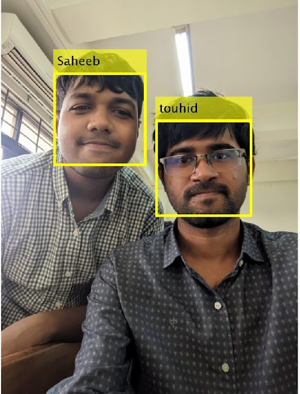

# Real Time Face Recognition with ML

This program employs several face recognition algorithm along with 2D wavelet transformation and uses the model with best training performances. In almost all test runs, SVM was the most accurate method.

Functionality includes, annotating an image with recognized face, annotating entire video with recognized face, real time annotation of webcam stream.
# How to use

Put the images of various persons on the `dataset` folder. The folder name should be the name of the person.

Run `create_dataset.m` to preprocess the image. Preprocessing crops the faces out and resizes the images.

Run `train_model.m` to train models with `SVM`, `KNN`, `Discriminant` algorithms. Training uses 2D wavelet transformation to extract features. The trained model is saved on the file `models.mat`.
## image inference
Use `input_image.m` script to predict the faces on an image.
## video inference
`input_video.m` annotates all the recognized face on a video and writes a new annotated video.
## real time inference
`live_detection.m` detects recognized face on live webcam stream.

# Results
## image inference

